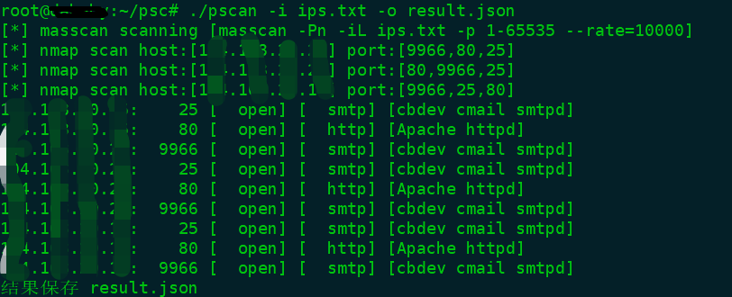

# pscan #

#### 介绍

masscan能够快速获取目标端口的开放状态，nmap能够准确地识别端口指纹，将两者的有点结合起来，使用masscan扫描端口的开放，然后使用nmap来识别端口指纹，最后保存到json文件中，易于后期对结果进行筛选处理。



#### 安装

```bash
编译需要golang环境
1、git clone https://github.com/aeverj/pscan.git
2、cd pscan
3、go build
```


#### 使用方法

```bash
Usage: pscan [192.168.1.1] [-i 目标文件] [-o 输出文件] [-p 端口] [-t nmap进程数量]
Options:
  -i string
    	扫描目标文件路径
  -o string
    	保存扫描结果的文件位置 (default "result.json")
  -p string
    	扫描的端口 (default "1-65535")
  -t int
    	启动nmap进程数量 (default 4)
```

#### 示例

默认扫描

```bash
pscan -i ips.txt
pscan 192.168.1.1/24
```

控制线程、结果保存文件

```bash
pscan 192.168.1.1/24 -t 2 -o my.json
```

